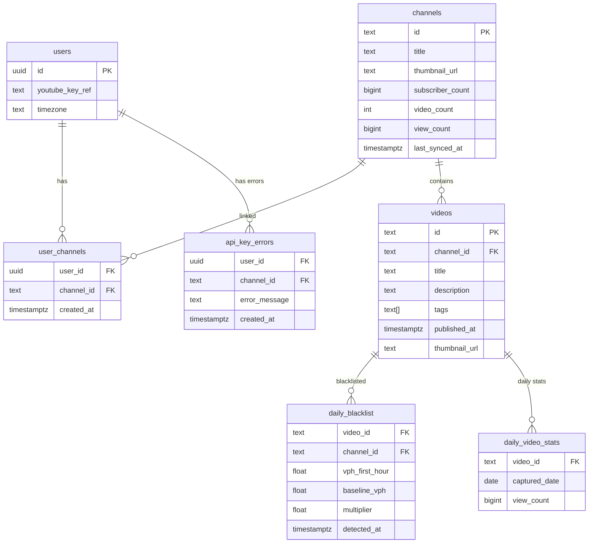
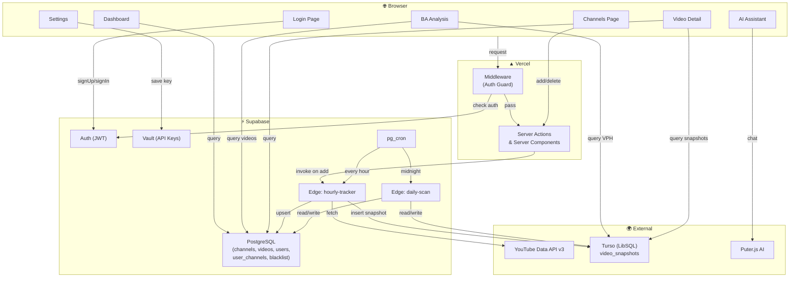

# 🏗️ YouTube Analyzer — Kiến Trúc Hiện Tại (V14)

## Tech Stack

| Category | Technology |
|----------|-----------|
| Framework | Next.js 14.2.35 (App Router) |
| Language | TypeScript 5 |
| Auth | Supabase Auth (email/password) |
| Primary DB | Supabase PostgreSQL |
| Time-series DB | Turso (LibSQL) |
| UI Library | shadcn/ui (base-nova) |
| CSS | Tailwind CSS v4 + tailwindcss-animate |
| Charts | Recharts 3.8.1 |
| Animations | Framer Motion 12.40.0 |
| Icons | Lucide React |
| AI | Puter.js (CDN) |
| Edge Functions | Supabase Edge Functions (Deno) |
| Cron | pg_cron (PostgreSQL) |
| Font | Inter (Google Fonts) |
| Hosting | Vercel (Frontend) + Supabase (Backend) |

---

## Cấu Trúc File

```
e:\youtube analyzer\
├── src/
│   ├── middleware.ts                    # Auth guard
│   ├── app/
│   │   ├── globals.css                  # Theme + custom styles (OKLCH)
│   │   ├── layout.tsx                   # Root layout (dark mode, Puter.js SDK)
│   │   ├── page.tsx                     # 📊 Dashboard/Overview
│   │   ├── login/
│   │   │   └── page.tsx                 # 🔐 Login/Signup (client component)
│   │   ├── channels/
│   │   │   ├── page.tsx                 # Server wrapper
│   │   │   ├── ChannelsClient.tsx       # 📺 Channel management UI
│   │   │   └── actions.ts              # addChannel, deleteChannel
│   │   ├── ba-analysis/
│   │   │   ├── page.tsx                 # 📈 BA Analysis (revenue + video list)
│   │   │   ├── ChannelSelector.tsx      # Dropdown chọn kênh
│   │   │   ├── EngagementChart.tsx      # VPH line chart (Recharts)
│   │   │   └── video/[videoId]/
│   │   │       └── page.tsx             # 🎬 Video detail (info + analytics)
│   │   ├── ai-assistant/
│   │   │   └── page.tsx                 # 🤖 AI Assistant (Puter.js)
│   │   └── settings/
│   │       ├── page.tsx                 # Server wrapper
│   │       ├── SettingsForm.tsx         # ⚙️ API Key + Timezone form
│   │       └── actions.ts              # saveUserSettings
│   ├── components/
│   │   ├── LayoutWrapper.tsx            # Sidebar toggle (hide on /login)
│   │   ├── Sidebar.tsx                  # Navigation sidebar
│   │   └── ui/                          # shadcn/ui: badge, button, card,
│   │                                    #   input, label, select, table, tabs
│   └── lib/
│       ├── turso.ts                     # Turso client
│       ├── supabase.ts                  # Service role client (unused)
│       ├── supabase-client.ts           # Browser client
│       ├── supabase-server.ts           # SSR client (cookie-based)
│       ├── ratelimit-db.ts              # Rate limiter (unused)
│       └── utils.ts                     # cn() utility
├── supabase/
│   └── functions/
│       ├── hourly-tracker/index.ts      # ⏰ Fetch YouTube data mỗi giờ
│       └── daily-scan/index.ts          # 🌙 Blacklist scan lúc midnight
└── package.json, next.config.mjs, tsconfig.json, ...
```

> [!NOTE]
> **Không có `src/app/api/`** — toàn bộ logic server dùng Server Actions, không có API routes.

---

## Database Schema

### Supabase (PostgreSQL)



### Turso (LibSQL) — Time-series

| Column | Type | Mô tả |
|--------|------|-------|
| `video_id` | TEXT | YouTube Video ID |
| `channel_id` | TEXT | YouTube Channel ID |
| `view_count` | INTEGER | Views tại thời điểm snapshot |
| `vph` | REAL | Views Per Hour (= views_now − views_trước) |
| `baseline_vph` | REAL | Trung bình VPH lịch sử |
| `spike_ratio` | REAL | vph / baseline_vph |
| `captured_at` | DATETIME | Thời điểm chụp |

> [!IMPORTANT]
> Turso tự dọn snapshots **> 48 giờ**. Chỉ lưu data 2 ngày gần nhất.

### Supabase Vault (Secrets)

- Mỗi user có 1 secret: `yt_key_{userId}` → YouTube API Key
- Truy cập qua RPC: `save_user_secret()`, `get_secret()`

---

## Data Flow



---

## Trang Chi Tiết

### 1. 🔐 Login (`/login`)

| Thuộc tính | Giá trị |
|---|---|
| Type | Client Component |
| Auth | Supabase email/password |
| Features | Sign In / Sign Up toggle, email confirmation |

### 2. 📊 Dashboard (`/`)

| Thuộc tính | Giá trị |
|---|---|
| Type | Server Component |
| Data sources | `user_channels` → `channels`, `daily_blacklist`, `api_key_errors` |

**Hiển thị:**
- 3 stat cards: Total Subscribers, Total Views, Avg VPH (placeholder)
- Last Sync badge (cảnh báo nếu > 2h)
- Bảng Recent Blacklisted Videos

### 3. 📺 Channels (`/channels`)

| Thuộc tính | Giá trị |
|---|---|
| Type | Server + Client Component |
| Data sources | `user_channels` → `channels` |
| Actions | `addChannel()`, `deleteChannel()` |

**Hiển thị:**
- Form add channel (ID hoặc @handle)
- Grid channel cards (thumbnail, title, subs, video count)
- Nút Analyze → redirect `/ba-analysis`
- Nút Delete (chỉ xoá link, không xoá channel)

### 4. 📈 BA Analysis (`/ba-analysis`)

| Thuộc tính | Giá trị |
|---|---|
| Type | Server Component |
| Data sources | Supabase: `user_channels`→`channels`, `videos`; Turso: `video_snapshots` |

**Hiển thị:**
- Channel selector dropdown
- Revenue tab: 3 CPM cards (Low $1.5 / Avg $3.5 / High $7.0)
- Engagement tab: VPH line chart (Recharts)
- Upload Heatmap tab: placeholder ⚠️
- Video Analytics: 3 tabs
  - **All Videos** — tất cả video, sắp xếp theo views
  - **Spiking** — VPH ≥ 3× baseline
  - **High VPH** — VPH ≥ 1,000

**VideoCard hiển thị:** Thumbnail, VPH badge, Title (clickable), Views, Published date, Spike ratio

### 5. 🎬 Video Detail (`/ba-analysis/video/[videoId]`)

| Thuộc tính | Giá trị |
|---|---|
| Type | Server Component |
| Data sources | Supabase: `videos`→`channels`, `daily_video_stats`; Turso: `video_snapshots` |

**Hiển thị:**
- Quick stats: Video ID, Channel, Thumbnail
- **Info tab**: Description, Tags
- **Analytics tab**: VPH chart (48h), Daily Views History

### 6. 🤖 AI Assistant (`/ai-assistant`)

| Thuộc tính | Giá trị |
|---|---|
| Type | Client Component |
| Auth | Puter.js (riêng biệt, KHÔNG dùng Supabase auth) |
| Data | ⚠️ **Mock data hardcoded** — KHÔNG kết nối DB thật |

**Hiển thị:**
- Weekly Report Generator
- BA Chatbot

### 7. ⚙️ Settings (`/settings`)

| Thuộc tính | Giá trị |
|---|---|
| Type | Client Component |
| Data sources | `users` table, Supabase Vault |
| Action | `saveUserSettings()` |

**Hiển thị:**
- YouTube API Key input (password)
- Timezone selector (4 options)
- Spike Multiplier slider (2x–10x) — ⚠️ **chưa lưu vào DB**

---

## Edge Functions

### ⏰ `hourly-tracker` (mỗi giờ)

```
Cho mỗi user có API key:
  → Lấy key từ Vault
  → Lấy danh sách kênh (via user_channels)
  → Lấy blacklist hôm nay (bỏ qua video bị blacklist)
  → Cho mỗi kênh:
      → Fetch channel stats từ YouTube API
      → Update bảng channels
      → Fetch 50 video mới nhất
      → Cho mỗi video (không bị blacklist):
          → Upsert metadata vào bảng videos
          → Tính VPH = views_now − views_trước
          → Tính baseline = AVG(VPH lịch sử)
          → Insert snapshot vào Turso
  → Dọn snapshots > 48h trong Turso
```

**Error handling**: Nếu YouTube API trả 403/5xx → log vào `api_key_errors` → user đó bị block, user khác không ảnh hưởng.

### 🌙 `daily-scan` (midnight theo timezone user)

```
Cho mỗi user đang ở 00:00 (midnight):
  → Lấy danh sách kênh
  → Reset daily_blacklist cho các kênh đó
  → Cho mỗi video (đăng ≥ 2h):
      → Lấy snapshot đầu ngày vs cuối ngày từ Turso
      → Tính VPH = (view cuối − view đầu) / số giờ
      → Tính baseline = AVG 30 ngày
      → Nếu VPH < baseline × 3 → BLACKLIST
      → Upsert daily_video_stats
```

---

## Sidebar Navigation

| # | Label | Route | Icon |
|---|-------|-------|------|
| 1 | Dashboard | `/` | LayoutDashboard |
| 2 | Channels | `/channels` | Tv |
| 3 | BA Analysis | `/ba-analysis` | BarChart3 |
| 4 | AI Assistant | `/ai-assistant` | Bot |
| 5 | Settings | `/settings` | Settings |

---

## Styling & Theme

- **Mode**: Dark only (hardcoded)
- **Color space**: OKLCH
  - Background: `oklch(0.13 0.02 260)` — deep dark blue
  - Primary: `oklch(0.65 0.25 280)` — vibrant blue-purple
  - Destructive: `oklch(0.6 0.2 20)` — red
- **Effects**: Glassmorphism (`.glass-card`), gradient text, ambient blurred circles
- **Animations**: `fade-in`, `slide-in-from-bottom` (tailwindcss-animate)

---

## ⚠️ Vấn Đề / Cần Cải Tiến

| # | Vấn đề | Mức độ |
|---|--------|--------|
| 1 | AI Assistant dùng **mock data**, không kết nối DB | 🔴 Major |
| 2 | Spike Multiplier slider **không lưu vào DB** | 🟡 Medium |
| 3 | Upload Heatmap tab **chưa implement** | 🟡 Medium |
| 4 | Dashboard Avg VPH card là **placeholder text** | 🟡 Medium |
| 5 | `supabase.ts` (service role client) **không dùng** ở đâu trong app | 🟢 Minor |
| 6 | `ratelimit-db.ts` **không import** ở đâu | 🟢 Minor |
| 7 | Revenue estimate dùng **5% total views** — rất thô sơ | 🟡 Medium |
| 8 | VideoCard thiết kế **basic**, thiếu micro-interactions | 🟡 Medium |
| 9 | Không có **toast/notification** khi add/delete channel | 🟡 Medium |
| 10 | Sidebar **không responsive** (mobile) | 🟡 Medium |
